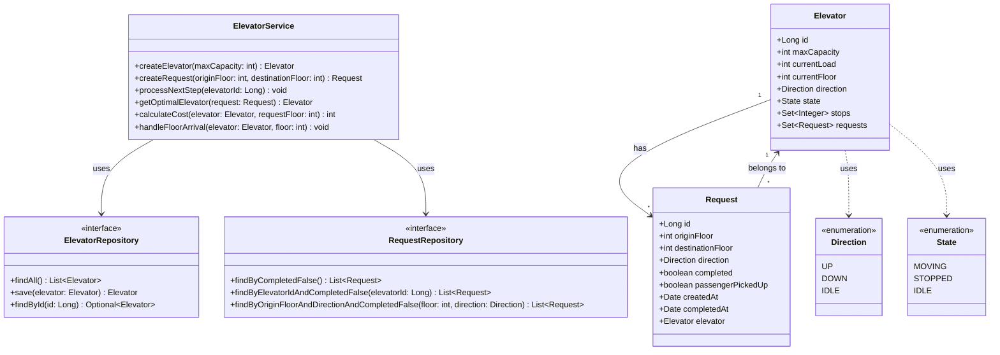

```mermaid
classDiagram
    class ElevatorService {
        +createElevator(maxCapacity: int) Elevator
        +createRequest(originFloor: int, destinationFloor: int) Request
        +processNextStep(elevatorId: Long) void
        +getOptimalElevator(request: Request) Elevator
        +calculateCost(elevator: Elevator, requestFloor: int) int
        +handleFloorArrival(elevator: Elevator, floor: int) void
    }

    class Elevator {
        +Long id
        +int maxCapacity
        +int currentLoad
        +int currentFloor
        +Direction direction
        +State state
        +Set~Integer~ stops
        +Set~Request~ requests
    }

    class Request {
        +Long id
        +int originFloor
        +int destinationFloor
        +Direction direction
        +boolean completed
        +boolean passengerPickedUp
        +Date createdAt
        +Date completedAt
        +Elevator elevator
    }

    class Direction {
        <<enumeration>>
        UP
        DOWN
        IDLE
    }

    class State {
        <<enumeration>>
        MOVING
        STOPPED
        IDLE
    }

    class ElevatorRepository {
        <<interface>>
        +findAll() List~Elevator~
        +save(elevator: Elevator) Elevator
        +findById(id: Long) Optional~Elevator~
    }

    class RequestRepository {
        <<interface>>
        +findByCompletedFalse() List~Request~
        +findByElevatorIdAndCompletedFalse(elevatorId: Long) List~Request~
        +findByOriginFloorAndDirectionAndCompletedFalse(floor: int, direction: Direction) List~Request~
    }

    ElevatorService --> ElevatorRepository : uses
    ElevatorService --> RequestRepository : uses
    Elevator "1" --> "*" Request : has
    Request "*" --> "1" Elevator : belongs to
    Elevator ..> Direction : uses
    Elevator ..> State : uses
```