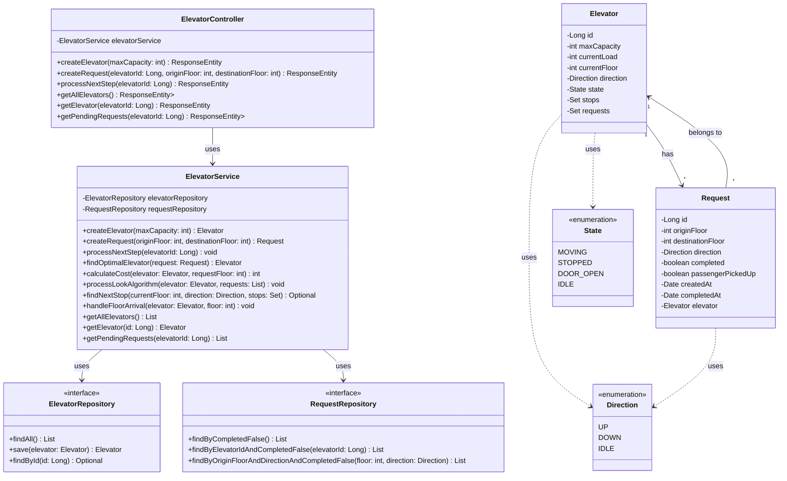

```mermaid
classDiagram
    class ElevatorController {
        -ElevatorService elevatorService
        +createElevator(maxCapacity: int) ResponseEntity<Elevator>
        +createRequest(elevatorId: Long, originFloor: int, destinationFloor: int) ResponseEntity<Request>
        +processNextStep(elevatorId: Long) ResponseEntity<Void>
        +getAllElevators() ResponseEntity<List<Elevator>>
        +getElevator(elevatorId: Long) ResponseEntity<Elevator>
        +getPendingRequests(elevatorId: Long) ResponseEntity<List<Request>>
    }

    class ElevatorService {
        -ElevatorRepository elevatorRepository
        -RequestRepository requestRepository
        +createElevator(maxCapacity: int) Elevator
        +createRequest(originFloor: int, destinationFloor: int) Request
        +processNextStep(elevatorId: Long) void
        +findOptimalElevator(request: Request) Elevator
        +calculateCost(elevator: Elevator, requestFloor: int) int
        +processLookAlgorithm(elevator: Elevator, requests: List<Request>) void
        +findNextStop(currentFloor: int, direction: Direction, stops: Set<Integer>) Optional<Integer>
        +handleFloorArrival(elevator: Elevator, floor: int) void
        +getAllElevators() List<Elevator>
        +getElevator(id: Long) Elevator
        +getPendingRequests(elevatorId: Long) List<Request>
    }

    class Elevator {
        -Long id
        -int maxCapacity
        -int currentLoad
        -int currentFloor
        -Direction direction
        -State state
        -Set<Integer> stops
        -Set<Request> requests
    }

    class Request {
        -Long id
        -int originFloor
        -int destinationFloor
        -Direction direction
        -boolean completed
        -boolean passengerPickedUp
        -Date createdAt
        -Date completedAt
        -Elevator elevator
    }

    class Direction {
        <<enumeration>>
        UP
        DOWN
        IDLE
    }

    class State {
        <<enumeration>>
        MOVING
        STOPPED
        DOOR_OPEN
        IDLE
    }

    class ElevatorRepository {
        <<interface>>
        +findAll() List<Elevator>
        +save(elevator: Elevator) Elevator
        +findById(id: Long) Optional<Elevator>
    }

    class RequestRepository {
        <<interface>>
        +findByCompletedFalse() List<Request>
        +findByElevatorIdAndCompletedFalse(elevatorId: Long) List<Request>
        +findByOriginFloorAndDirectionAndCompletedFalse(floor: int, direction: Direction) List<Request>
    }

    ElevatorController --> ElevatorService : uses
    ElevatorService --> ElevatorRepository : uses
    ElevatorService --> RequestRepository : uses
    Elevator "1" --> "*" Request : has
    Request "*" --> "1" Elevator : belongs to
    Elevator ..> Direction : uses
    Elevator ..> State : uses
    Request ..> Direction : uses
```